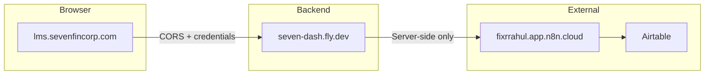

# CORS and N8n System Audit – Reference

This document summarizes the CORS/N8n audit findings and provides verification commands for lms.sevenfincorp.com.

## Architecture



The browser never talks to n8n directly; all n8n calls are server-side.

## Environment Variable Checklist

| Variable | Required | Production Source |
|----------|----------|-------------------|
| N8N_BASE_URL | Yes | Fly secrets |
| CORS_ORIGIN | Yes (prod) | Fly secrets |
| JWT_SECRET | Yes | Fly secrets |
| NODE_ENV | Yes | Fly secrets |
| VITE_API_BASE_URL | Yes (prod) | Vercel env |
| N8N_HEALTH_CHECK_ENABLED | No | Optional; set to `true` to enable n8n reachability check in `/health` |

## Verification Commands

### CORS preflight

```bash
curl -s -I -X OPTIONS "https://seven-dash.fly.dev/api/auth/login" \
  -H "Origin: https://lms.sevenfincorp.com" \
  -H "Access-Control-Request-Method: POST" \
  -H "Access-Control-Request-Headers: Content-Type"
```

Look for: `Access-Control-Allow-Origin: https://lms.sevenfincorp.com`

### Login

```bash
curl -X POST "https://seven-dash.fly.dev/api/auth/login" \
  -H "Content-Type: application/json" \
  -d '{"email":"YOUR_EMAIL","password":"YOUR_PASSWORD"}'
```

### Backend health

```bash
curl -s https://seven-dash.fly.dev/health
```

### Debug webhook config

```bash
curl -s https://seven-dash.fly.dev/api/debug/webhook-config
```

## Recommendations

1. **CORS_ORIGIN** – Use `https://lms.sevenfincorp.com,https://seven-dashboard-seven.vercel.app` for production and Vercel previews. Set via `./scripts/set-fly-secrets-lms.sh`.

2. **N8N_BASE_URL** – Ensure Fly.io can reach n8n (no firewall/network restrictions).

3. **Legacy libs** – Removed. All webhook calls go through `backend/src/services/airtable/n8nClient.ts`.

4. **Monitoring** – Optional n8n reachability check: set `N8N_HEALTH_CHECK_ENABLED=true` on Fly to include n8n in `/health`. Disabled by default to avoid exhausting n8n executions.

5. **CSP** – `connectSrc` in server.ts includes N8N_BASE_URL; confirm it matches your n8n instance.

## Vercel Preview URLs

Vercel preview deployments use unique URLs (e.g. `seven-dashboard-seven-abc123-seven.vercel.app`). CORS does not support wildcards for subdomains. To test from a preview deployment, add that specific URL to `CORS_ORIGIN` on Fly.io when needed.
