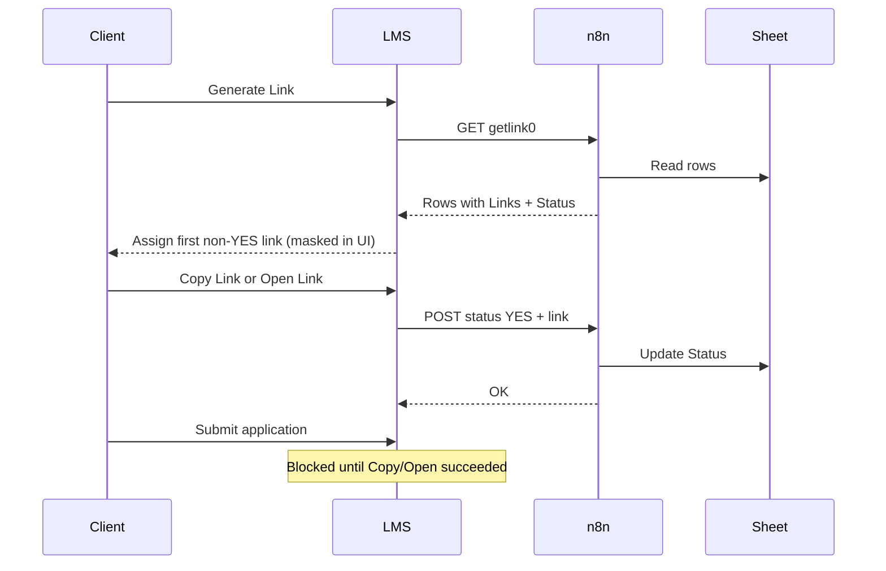

# Document folder link pool (Google Sheet via n8n)

Clients receive a shared Google Drive / OneDrive folder link from a pool stored in Google Sheets. The LMS reads and updates that pool through the n8n **getlink0** webhook.

## Sheet contract

| Column (n8n field) | Purpose |
|--------------------|---------|
| `Links` | Full folder URL (Drive, OneDrive, or SharePoint) |
| `Status` | Empty = available; `YES` = consumed / assigned |

Alternative field names supported by the backend parser: `links`, `link`, `url`, `Status`, `status`, `Used`, `used`.

## n8n webhook contract

**Base URL (production):** `https://fixrrahul.app.n8n.cloud/webhook/getlink0`

### GET — list pool

- Must return sheet rows **synchronously** in the HTTP response body.
- If n8n only responds with `{ "message": "Workflow was started" }`, the backend polls up to 3 times (~350 ms apart). Prefer configuring the GET webhook to **Respond to Webhook** with rows directly.

### POST — mark link consumed

```json
{
  "status": "YES",
  "link": "https://drive.google.com/drive/folders/..."
}
```

- `link` must match the sheet row exactly (trimmed).
- Return HTTP 200 on success. If the update fails, return JSON with `{ "success": false, "error": "..." }` so the API can surface a 502 to the client.

## Application flow



1. **Generate Link** — fetches pool, skips `Status = YES`, assigns first unused link (UI shows masked bullets).
2. **Copy Link / Open Link** — POSTs `YES` for that URL; required before final submit.
3. **Save as Draft** — does not require Copy/Open.
4. **Submit** — requires valid folder link **and** that Copy/Open completed successfully.

## API endpoints

| Method | Path | Role |
|--------|------|------|
| GET | `/api/client/link-pool` | Client (authenticated) |
| POST | `/api/client/link-pool/consume` | Client (authenticated) |

Implementation: [`backend/src/controllers/client.controller.ts`](../backend/src/controllers/client.controller.ts)

Frontend: [`src/pages/NewApplication.tsx`](../src/pages/NewApplication.tsx)

## Verification script

From repo root:

```bash
# List pool rows
npx tsx backend/scripts/test-getlink0-webhook.ts

# Mark a specific link as YES (use a test URL only)
npx tsx backend/scripts/test-getlink0-webhook.ts --consume "https://drive.google.com/drive/folders/..."
```

Optional env: `N8N_GET_LINK_WEBHOOK_URL`

## Troubleshooting

| Symptom | Likely cause |
|---------|----------------|
| "No unused links are available" | All rows have `YES`, or GET returned empty |
| "Link webhook acknowledged execution but returned no link data" | GET webhook runs async; fix n8n to return rows in response |
| "Failed to mark link used" / 502 on consume | POST workflow error, or row not found for exact URL |
| Submit blocked after Generate | User must click **Copy Link** or **Open Link** first |
| Same link offered twice (different browsers) | Previous session never POSTed YES; check consume workflow |

## Related docs

- [Support runbook: documents folder sharing](./SUPPORT_DOCUMENTS_FOLDER_SHARING.md)
