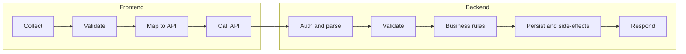

# Form Input Flow – Logical Steps and Checklist

Whenever a user enters data in a form and submits, a defined sequence of steps must run. This doc is the **contract**: what has to happen, where, and how to check that nothing is skipped.

---

## 1. The Five Phases (Every Form Submit)

For each phase, the sections below define required steps and a checklist.

---

## 2. Frontend Phase

### 2.1 Collect

- [ ] All form fields bound to state (no uncontrolled inputs that get lost).
- [ ] File uploads: either in state before submit or passed in the same request (e.g. `documentUploads`, `uploadedFiles`). No “forgot to include files” on submit.
- [ ] Draft vs submit: if there is “Save as draft” and “Submit”, the choice is passed correctly (`saveAsDraft`, `submit` flag, or distinct endpoints).

### 2.2 Validate (before API call)

- [ ] **Required fields**: same rules as backend. If backend blocks on mandatory fields, frontend must validate them (and show errors) so the user is not sent a 400 after click.
- [ ] **Types**: numbers, dates, emails in the right format (or clearly “best effort” with backend as source of truth).
- [ ] **Draft vs submit**: drafts may skip some required checks; submits must enforce them. Document which validations are “submit-only”.
- [ ] **Uploads in progress**: if files must be uploaded before submit, disable submit or block until `uploadingFiles` is clear. (See NewApplication: “Please wait for file uploads to complete”.)

### 2.3 Map to API

- [ ] Field names match what the backend expects (`applicantName` vs `applicant_name`, `formData` vs `form_data`, etc.). One canonical mapping per form → endpoint.
- [ ] Nested structures: `formData` as object, `documentUploads` as `{ fieldId, fileUrl, fileName }[]`, etc. No mismatched shapes.
- [ ] `clientId` / `productId` / `applicationId`: when the backend needs them, they are included (from route, from auth, from form).

### 2.4 Call API and post‑submit

- [ ] **Loading state**: `submitting` (or similar) set to `true` before the request, `false` in `finally`. Buttons disabled while `submitting`.
- [ ] **Idempotency / double‑click**: submit button disabled or guarded so the same request is not fired twice.
- [ ] **Success**: user feedback (toast, alert, `setSuccess`), then either redirect, reset form, or refetch. Document which.
- [ ] **Error**: show `response.error` or a safe fallback; do not only `console.error`. If 400 and `missingFields`, show them.
- [ ] **Auth**: if 401/403, redirect to login or re‑auth. Do not leave user on a dead form with no explanation.

---

## 3. Backend Phase

### 3.1 Auth and parse

- [ ] **Role check**: endpoint allows the role that the form user has (e.g. `requireClient`, `requireKAM`). 403 if not allowed.
- [ ] **Body parsing**: `req.body` read correctly. If `formData` is nested or JSON string, parse it once and validate type. (e.g. `typeof formData === 'string' ? JSON.parse(formData) : formData`).
- [ ] **Ownership when applicable**: for “application :id” or “client :id”, verify `application.Client === req.user.clientId` (or equivalent) before any mutation. 404 if not found or not owned.

### 3.2 Validate

- [ ] **Required fields**: for submit (non‑draft), mandatory fields from Form Fields / Client Form Mapping are checked. Use `validateMandatoryFields` or `validateFormData` as the single source; do not re‑implement ad hoc.
- [ ] **Status / transition**: if the action changes status, ensure current status allows it (e.g. submit only from `DRAFT` or `QUERY_WITH_CLIENT`). Use `validateTransition` when you have a state machine.
- [ ] **Documents for file fields**: if a mandatory field is “file”, acceptance of a document URL or `documentUploads` entry is part of validation. (`mandatoryFieldValidation.service` + `documentLinks`.)

### 3.3 Business rules

- [ ] **Draft vs submit**: draft may skip mandatory validation and leave status as `DRAFT`; submit sets `Submitted Date`, status → `UNDER_KAM_REVIEW`, and may freeze `Form Config Version`.
- [ ] **Duplicate / PAN**: if you run duplicate checks (e.g. PAN), decide: block, or warn and allow. Document it. (Current: warn and allow.)
- [ ] **Form config version**: on create and submit, set or freeze `Form Config Version` when the design requires it.

### 3.4 Persist and side‑effects

For each **type of form action**, the table below lists actions that must be considered. “Must” = required for correctness/audit; “Should” = required for product behaviour in your setup.

| Action | Persist (Airtable/n8n) | Audit / log | Notify | Other |
|--------|-------------------------|-------------|--------|-------|
| **Create application** (draft) | `postLoanApplication` | `logApplicationCreated` | — | — |
| **Create application** (submit) | `postLoanApplication` (status, Submitted Date) | `logApplicationCreated`, `logStatusChange`, `logApplicationAction` | KAM (`createNotification`) | Optional: Asana task |
| **Update form** (draft) | `postLoanApplication` (Form Data, Last Updated) | `logApplicationAction` (or equivalent) | — | — |
| **Submit application** | `postLoanApplication` (Status, Submitted Date, Form Config Version) | `logApplicationAction`, `recordStatusChange` | — | Optional: Asana; `validateMandatoryFields`; `validateTransition` |
| **Raise query** (KAM→Client, Credit→KAM) | `postLoanApplication` (Status), `postFileAuditLog` (or query table), notification | Audit for “query raised” | Affected user | `createQuery` / query service |
| **Reply to query** | `postLoanApplication` (Status if back to KAM review), query resolution, `postFileAuditLog` | Audit for “query resolved” | Query raiser | — |
| **Forward to credit** | `postLoanApplication` (Status) | `logApplicationAction`, `recordStatusChange` | Credit / relevant | `validateTransition` |
| **Create client** | `postClient` (or n8n), `postUserAccount` when you create login | — | — | Assigned KAM set; `postClient` shape matches Airtable |
| **Form configuration save** | `postClientFormMapping` (or bulk), `postClient` (Enabled Modules) | — | — | KAM–client auth in `createFormMapping` |
| **Payout request** | Ledger / payout table | — | — | — |
| **NBFC decision** | `postLoanApplication` (status, decision fields) | `logApplicationAction`, `recordStatusChange` | — | `validateTransition` |

Checklist for **persist and side‑effects**:

- [ ] **Primary write**: the main entity (application, client, mapping, query, etc.) is written via the correct n8n/Airtable path. Field names match Airtable (e.g. `Form Data` as stringified JSON, `Assigned KAM` as KAM id).
- [ ] **Audit / logging**: every state‑changing form action is logged (Admin Activity, File Auditing, or `centralizedLogger` / `logApplicationAction`). No silent mutations.
- [ ] **Status changes**: if status changes, it goes through `validateTransition` (when you have it) and `recordStatusChange` (when you have history). `postLoanApplication` includes the new `Status` and `Last Updated`.
- [ ] **Notifications**: when the workflow says “notify KAM on submit” or “notify client on query”, the corresponding `createNotification` (or equivalent) is called. Recipient id from the right source (e.g. `client['Assigned KAM']` for KAM).
- [ ] **Non‑blocking extras**: Asana, optional webhooks, etc. should not block the HTTP response. Use `(async () => { ... })().catch(...)` or a job queue. If they fail, log and continue.

### 3.5 Respond

- [ ] **Success**: 200 + JSON with at least `{ success: true }` and any IDs (e.g. `applicationId`, `fileId`) or messages the frontend needs for redirect or display.
- [ ] **Validation error**: 400 + `{ success: false, error, missingFields? }`. `missingFields` when mandatory validation fails.
- [ ] **Not found / forbidden**: 403 or 404 with a clear `error` message. No 200 with empty data for “not found”.
- [ ] **Server error**: 500 with a safe `error` message (no stack or internals to the client). Log full error server‑side.

---

## 4. Form‑to‑Endpoint Map (Reference)

Use this to audit “does this form trigger all the right backend steps?”

| Form / action | Frontend (page/hook) | API endpoint | Backend handler |
|---------------|----------------------|--------------|-----------------|
| New application (draft) | `NewApplication` | `POST /loan-applications` | `createApplication` → `loanWorkflowService.createLoanApplication` |
| New application (submit) | `NewApplication` | `POST /loan-applications` with `saveAsDraft: false` | same; workflow sets status, logs, notifies KAM |
| Save draft form | `NewApplication` | `POST /loan-applications/:id/form` | `updateApplicationForm` |
| Submit draft | `NewApplication` | `POST /loan-applications/:id/submit` | `submitApplication` (mandatory, status, audit, Asana) |
| Client form (public) | `ClientForm` | `POST /loan-applications` | `createApplication` (needs `clientId` from route) |
| Onboard client | `Clients` | `POST /kam/clients` | `createClient` (KAM only) |
| Form config save | `FormConfiguration` | `POST /kam/clients/:id/form-mappings` | `createFormMapping` |
| Raise query (KAM→Client) | `ApplicationDetail` | `POST /kam/loan-applications/:id/queries` | `raiseQuery` |
| Raise query (Credit→KAM) | `ApplicationDetail` | `POST /credit/loan-applications/:id/queries` | `raiseQuery` |
| Reply to query | `ApplicationDetail` | `POST /loan-applications/:id/queries/:queryId/reply` | `respondToQuery` |
| Forward to credit | `ApplicationDetail` | `POST /kam/loan-applications/:id/forward-to-credit` | `forwardToCredit` |
| Edit application (KAM) | `ApplicationDetail` | `POST /kam/loan-applications/:id/edit` | `editApplication` |
| Login | `Login` | `POST /auth/login` or `auth/validate` | auth controller |
| Payout request | `Ledger` | Ledger endpoint | ledger controller |
| NBFC decision | `ApplicationDetail` (NBFC) | `POST /nbfc/loan-applications/:id/decision` | `recordDecision` |

---

## 5. How to Find Gaps (Audit)

### 5.1 Frontend

1. **List all submit handlers**: `handleSubmit`, `onSubmit`, `onClick` that call `apiService.*` with body from form state.
2. For each:
   - Is there **validation** before `apiService.*`? If the backend returns 400 for mandatory/format, does the frontend show it?
   - Is **loading/disabled** set so the user cannot double‑submit?
   - On **success**, does the user get feedback and the right next step (redirect, reset, refetch)?
   - On **error**, is `response.error` or `missingFields` shown?
3. **File uploads**: for forms with file fields, is the file (or its stored URL) included in the payload the backend expects? Any “upload after submit” or “upload in parallel” must be finished before submit, or the backend must accept a later `:id/form` update.

### 5.2 Backend

1. **List all POST (and PUT/PATCH) handlers** that change data (loan app, client, mapping, query, ledger, etc.).
2. For each:
   - **Auth**: role and, when relevant, resource ownership (application, client) before any write.
   - **Parse**: `req.body` and nested/stringified fields (e.g. `Form Data`) correctly parsed.
   - **Validate**: mandatory fields, status, transitions. Is there a **single** validator (e.g. `validateMandatoryFields`, `validateFormData`) used, or ad‑hoc logic that can drift?
   - **Persist**: the main entity written with the right fields. No “we update status but forget Last Updated” or “we never send Form Data”.
   - **Audit**: at least one log for the action (`logApplicationAction`, `centralizedLogger`, File Auditing, etc.).
   - **Notify**: if the workflow requires it (e.g. KAM on submit, client on query), is `createNotification` (or equivalent) called with the correct recipient?
   - **Respond**: 200 with `success: true` and needed ids/message; 400 for validation with `error` and `missingFields` when relevant; 403/404/500 with a clear `error`.

### 5.3 Cross‑check

- For each **form → endpoint** row in the map, confirm:
  - Frontend sends the body shape the backend expects (field names, `formData`, `documentUploads`, `saveAsDraft`, etc.).
  - Backend runs the full **persist + side‑effects** set for that action (see table in 3.4). If “Notify KAM on submit” is in the table, `createLoanApplication` (or submit path) must call it when `!saveAsDraft`.

---

## 6. Tests to Lock In the Sequence

### 6.1 Frontend

- **Submit with empty required fields**: assert that (a) the API is **not** called, or (b) if you intentionally let it through, the UI shows validation errors from state. No silent ignore of required fields.
- **Submit with all required filled**: API is called once, with the expected body shape (snapshot or explicit asserts on `formData`, `applicantName`, `saveAsDraft`, etc.).
- **Double‑click submit**: only one API call (mock `apiService` and count calls).
- **On 400 with `missingFields`**: the `missingFields` (or `error`) are rendered; user can correct and resubmit.
- **On 401/403**: redirect to login or show “session expired” (depending on your auth flow).

### 6.2 Backend

- **Submit with missing mandatory**: `validateMandatoryFields` (or equivalent) returns `isValid: false`; handler returns 400 with `missingFields`; no `postLoanApplication` (or other write) for the new status.
- **Submit with mandatory satisfied**: handler returns 200; `postLoanApplication` (or equivalent) is called with the new status and `Submitted Date`; `logApplicationAction` (or equivalent) and, when applicable, `createNotification` are invoked (mock and assert).
- **Draft**: no mandatory validation; `postLoanApplication` with `DRAFT`; no KAM notification. `logApplicationCreated` (or equivalent) still called.
- **Wrong status**: e.g. submit when status is already `UNDER_KAM_REVIEW` → 400, no status change, no extra audit for “submitted”.

### 6.3 Integration (optional but useful)

- **Create draft → Update form → Submit**: one flow where create returns `applicationId`, form update is called with `:id`, submit is called with `:id`. Assert the final application in the data store has `Status = UNDER_KAM_REVIEW`, `Submitted Date` set, and at least one audit log entry for submission.

---

## 7. One‑Page Quick Checklist (Copy per Form)

Use this when adding or changing a form that submits data.

**Frontend**

- [ ] Required fields validated before submit (or clearly “backend is source of truth” and 400 is shown).
- [ ] Loading/disabled during submit; no double submit.
- [ ] Body matches backend: field names, `formData`, `documentUploads`, `saveAsDraft`, ids.
- [ ] Success: feedback + redirect/reset/refetch.
- [ ] Error: show `error` and `missingFields` when present; 401/403 → re‑auth or redirect.

**Backend**

- [ ] Auth and ownership checked.
- [ ] Body and nested/stringified fields parsed.
- [ ] Mandatory validation (for submit) and status/transition checks.
- [ ] Primary write (e.g. `postLoanApplication`) with correct fields.
- [ ] Audit/log for the action.
- [ ] Notify when the workflow requires it.
- [ ] 200 with `success` and needed data; 400 with `error` and `missingFields`; 403/404/500 with `error`.

**Cross‑check**

- [ ] Form → endpoint in the **Form‑to‑Endpoint Map** and **Persist and side‑effects** table.
- [ ] At least one test that asserts “submit with required empty → no write / 400” and “submit with required filled → write + audit (+ notify when applicable)”.

---

## 8. Where This Lives in the Repo

- **Frontend**: `src/pages/NewApplication.tsx`, `ClientForm.tsx`, `ApplicationDetail.tsx`, `FormConfiguration.tsx`, `Clients.tsx`, `Login.tsx`, `Ledger.tsx`, etc.
- **Backend**: `loan.controller.ts` (create, update form, submit), `kam.controller.ts` (edit, forward, raise query), `client.controller.ts` (reply to query), `credit.controller` (queries, status changes), `ledger.controller`, `auth.controller`.
- **Validation**: `formValidation.service.ts`, `mandatoryFieldValidation.service.ts`, `duplicateDetection.service.ts`; `statusStateMachine` and `statusHistory.service` for transitions.
- **Workflow / side‑effects**: `loanWorkflow.service.ts`, `centralizedLogger`, `logApplicationAction`, notification creation, Asana.

When you add a new form or a new backend action, update the **Form‑to‑Endpoint Map** and the **Persist and side‑effects** table, and run the quick checklist so no logical step is dropped.

**See also:** [System Sync Actions Checklist](SYSTEM_SYNC_ACTIONS_CHECKLIST.md) – webhooks, cache invalidation, status transitions, and frontend refetch for concurrent sync.
