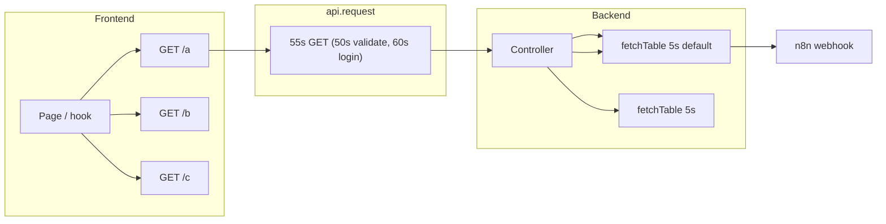

# GET and Page Load – Data Dependencies, Timeouts, and Checklist

Pages often need **multiple data points** to render. Each is usually one GET (or a shared hook that does one GET). This doc covers: (1) whether all required data is loaded, (2) whether it finishes before timeouts, (3) parallel vs sequential and partial failure, and (4) how to audit and test.

**Summary: Are GETs logical? Will sections load before the timeout?**  
All backend GETs have a worst-case of **≤15s** (KAM `getApplication` / `getQueries`). The frontend GET timeout is **55s**, so no GET should hit the timeout controller from backend duration alone. Two real risks: (1) **n8n `fetchTable` 5s** – on n8n slowness it returns `[]` and the controller sends 200 with partial/empty data, so sections can appear “not loaded” without a timeout message; (2) **`isPageReload`** – several pages only fetch when `isPageReload()` is true, so on SPA navigation those sections stay empty until F5. How to check: run the commands in **§4.4** and/or `node scripts/audit-get-flows.js`.

---

## 1. Timeout Chain (Where Timeouts Apply)



| Layer | Timeout | Scope | On timeout |
|-------|---------|-------|------------|
| **Frontend `api.request()`** | GET: 55s (50s validate, 60s login) | Per HTTP request | `AbortError` → user sees "Request timed out after X seconds" |
| **Backend (Express)** | None by default | Per request | — |
| **n8n `fetchTable()`** | 5s default (some 2s, 5s, 10s) | Per webhook call | Returns `[]`, does not throw |

So:

- A **single GET** from the frontend has up to **55s** before the user sees a timeout.
- That GET hits the backend, which may call **several** `fetchTable` in parallel or sequence. Each `fetchTable` has **5s** (or overridden). If n8n is slow, `fetchTable` returns `[]` on 5s timeout; the controller can still respond with 200 and partial/empty data.
- **Risk**: Backend returns 200 with empty or partial data (e.g. applications=`[]` because Loan Application webhook timed out) and the frontend shows an empty page or broken sections. No explicit “timeout” in UI.

---

## 2. Page → Data Dependencies and GETs

For each main page, this table lists **which GETs** it uses, **order** (parallel vs sequential), and **loading/error** behavior.

| Page | Data needed | GETs (apiService / hook) | Parallel? | Loading state | If one fails / times out |
|------|-------------|---------------------------|-----------|---------------|---------------------------|
| **ApplicationDetail** | App, Queries, Audit (status history) | `getApplication(id)`, `getQueries(id)`, `getFileAuditLog(id)` | Yes (3 in parallel) | One `loading` for main app; Queries and Status History have no separate loading | App: `setApplication(null)`, redirect or “not found”. Queries: `setQueries([])`. Audit: status history stays `[]`. No per-section “Failed to load” in many cases. |
| **NewApplication** (client) | formConfig, configuredProducts, loanProducts | `getFormConfig()`, `getConfiguredProducts()`, `listLoanProducts(true)` | Form+Config parallel; `listLoanProducts` after `configuredProductsFetched` | `formConfigLoading`, `loanProductsLoading` | Form/config: `[]` or “Load form”. Products: `loanProductsError` or `[]`. |
| **KAMDashboard** | applications, clients | `useApplications` → `listApplications()`, `listClients()` | Yes (both on mount; clients only on `isPageReload` in some code) | `loading` (apps), `loadingClients` | Apps: `[]`. Clients: `clientsError` or `[]`. **Gap**: on SPA nav, `listClients` may never run (`isPageReload`). |
| **ClientDashboard** | applications, loanProducts, configuredProducts | `useApplications`, `listLoanProducts`, `getConfiguredProducts` | All can run in parallel from useEffects | `loading`, product load in hooks | Apps/products: empty or error state. |
| **Applications** | applications | `useApplications` → `listApplications()` | One GET | `loading` | `[]` or error. |
| **Clients** | clients | `listClients` or `listCreditClients` | One GET | `loading` | `[]`, `debugInfo` on error. **Gap**: fetch only on `isPageReload`; SPA nav → `[]`. |
| **FormConfiguration** | clients, loanProducts | `listClients()`, `listLoanProducts(true)` | Parallel (in one or two useEffects) | `loading` | Empty lists or error. |
| **Ledger** | ledger, payoutRequests | `useLedger` → `getClientLedger` or `getPayoutRequests` / `getClientPayoutRequests` | One GET per view | `loading` | `[]` or error. **Gap**: `useLedger` fetches only on `isPageReload`. |
| **ClientForm** (public) | formMappings, formCategories, clients (fallback) | `getPublicFormMappings(clientId)`, `listFormCategories()`, `listClients()` in some paths | Sequential: mappings first, then categories; clients in other flow | Local loading | Empty or error. |
| **Reports** | daily summaries | `listDailySummaries(7)` | One GET | `loading` | `[]` or error. Fetch only on `isPageReload`. |
| **Login / Validate** | — | `auth/validate` or `auth/login` | One | — | 50s / 60s timeout. |

**Backend GETs that fetch multiple tables (and how):**

| Endpoint | Tables / calls | Parallel? | n8n timeout | Comment |
|----------|----------------|-----------|-------------|---------|
| `GET /loan-applications` | Loan Application, Clients, Loan Products | `Promise.allSettled` | 5s default each | Partial: if one fails, `[]` for that; others used. |
| `GET /loan-applications/:id` | Loan Application, then File Auditing Log | Sequential | 5s each | ~10s max. Audit in `getApplication` is only for `auditLog`; frontend also calls `getFileAuditLog` separately. |
| `GET /loan-applications/:id/queries` | (query service: File Auditing Log etc.) | — | — | Depends on query service impl. |
| `GET /loan-applications/:id/audit-log` | Loan Application, File Auditing Log | `Promise.all` | 5s each | ~5s wall. |
| `GET /client/dashboard` | Loan Application, Commission Ledger, File Auditing Log | `Promise.allSettled` | 5s each | Partial failure → `[]` for that slice. |
| `GET /kam/dashboard` | (User Accounts, Loan Application) then (Commission Ledger, File Auditing Log) | 2× `Promise.all` (sequential) | 5s each | ~10s + RBAC (which may add Clients + KAM Users). |
| `GET /client/form-config` | Client Form Mapping, Form Categories, Form Fields, optional Loan Application (for version) | formConfigService + sometimes Loan Application | `Promise.all` in service; extra fetch if `applicationId` | 5s each. |
| `GET /loan-products` | Loan Products | 1 | 5s (explicit) | On error, products controller returns 200 + `data:[]`. |
| `GET /kam/clients` | Clients, sometimes KAM Users (for KAM id resolve) | 1 or 2 | 5s | — |

---

## 2b. Backend GET: fetchTable waves and worst-case duration

Use this table to see if any single GET can exceed the frontend 55s timeout. Each `fetchTable` has 5s default (or overridden). **Worst-case** = sum of sequential waves; one parallel batch = 5s.

| Endpoint | fetchTable waves (sequential) | Worst-case | &lt;55s? | Notes |
|----------|-------------------------------|------------|---------|-------|
| `GET /loan-applications` | allSettled(3). For **KAM**: filterLoanApplications → getKAMManagedClientIds(2) | 5s (others). **KAM: 10s** (5s+5s) | Yes | |
| `GET /loan-applications/:id` | Loan App → filter (KAM: getKAM 2) → File Auditing Log | **KAM: 15s**. Others: 10s | Yes | 3 waves for KAM |
| `GET /loan-applications/:id/queries` | Loan App → filter (KAM: getKAM 2) → getQueriesForFile(File Auditing Log) | **KAM: 15s**. Others: 10s | Yes | 3 waves for KAM |
| `GET /loan-applications/:id/audit-log` | all(Loan App, File Auditing Log) → filter (KAM: getKAM 2) | **KAM: 10s**. Others: 5s | Yes | |
| `GET /client/dashboard` | allSettled(Loan App, Commission Ledger, File Auditing Log) | 5s | Yes | |
| `GET /client/form-config` | If `applicationId`: Loan App (5s) then getClientDashboardConfig all(4) | 10s. Else: 5s | Yes | |
| `GET /client/configured-products` | formConfigService (Client Form Mapping + Form Categories + Form Fields + Clients) | 5s | Yes | |
| `GET /kam/dashboard` | getKAMManagedClientIds(2) → all(Clients, Loan App, Commission Ledger, File Auditing Log) | 10s | Yes | 2 waves |
| `GET /kam/clients` | Clients; if !kamId: KAM Users | 5s or 10s | Yes | |
| `GET /kam/loan-applications` | Loan App → filter (getKAM 2) | 10s | Yes | |
| `GET /credit/dashboard` | allSettled(Loan App, Commission Ledger, File Auditing Log) | 5s | Yes | |
| `GET /credit/loan-applications` | like loan list; credit: no getKAM | 5s | Yes | |
| `GET /clients/me/ledger` | Commission Ledger | 5s | Yes | |
| `GET /clients/me/payout-requests` | Commission Ledger | 5s | Yes | |
| `GET /reports/daily/list` | Daily Summary Report | 5s | Yes | |
| `GET /reports/daily/latest` | Daily Summary Report | 5s | Yes | |
| `GET /reports/daily/:date` | Daily Summary Report | 5s | Yes | |
| `GET /notifications` | Notifications | 5s | Yes | |
| `GET /notifications/unread-count` | Notifications | 5s | Yes | |
| `GET /loan-products` | Loan Products (5s explicit) | 5s | Yes | |
| `GET /loan-products/:id` | Loan Products | 5s | Yes | |
| `GET /loan-applications/:id/audit-log` | all(Loan App, File Auditing Log) → filter (KAM: getKAM 2) | KAM: 10s; others: 5s | Yes | audit.controller.getFileAuditLog |
| `GET /audit/admin/activity-log` | Admin Activity Log | 5s | Yes | |

**Summary**: Max worst-case **15s** (KAM `getApplication`, `getQueries`). All are well under the frontend **55s** GET timeout. **Risk**: If n8n routinely takes &gt;5s per webhook, `fetchTable` returns `[]` on timeout and controllers respond 200 with partial/empty data—sections then “don’t load” without a visible timeout.

---

## 3. Logical and Timing Pitfalls

### 3.1 Data not loaded in time (before timeout)

- **Frontend**: A GET has 55s. If the backend takes 60s (e.g. many sequential `fetchTable` or slow n8n), the **frontend** aborts and the user sees a timeout. The backend may still complete and log.
- **Backend**: `fetchTable` uses 5s. If n8n is slow, `fetchTable` returns `[]` and the controller often continues with empty/partial data and 200. So:
  - **No** backend “timeout” to the client; the client only sees a timeout from the **frontend** 55s.
  - **Yes** to “sections not loading”: e.g. `listApplications` gets `applications=[]` because Loan Application webhook hit 5s; Clients and Loan Products may be fine. Response is 200 with `data: []` or incomplete. UI shows empty list, not “timeout”.

**Check**: For each heavy GET (many tables or slow n8n), add the **worst-case backend duration**:

- If all `fetchTable` in that request are in one `Promise.all` / `Promise.allSettled`: `max(5s, 5s, …)` ≈ 5s per “wave”.
- If there are **sequential** `Promise.all` or `await fetchTable` chains: sum the waves (e.g. 5s + 5s + 5s = 15s).

If that sum gets close to **55s**, or if n8n often exceeds 5s, you risk frontend timeout or repeated empty data. Mitigations: raise n8n `fetchTable` timeout for critical tables (and document), or combine backend calls so one GET does not do many sequential waves.

### 3.2 Sections not loading because of `isPageReload`

Several pages only fetch when `isPageReload()` is true. On **SPA navigation** (e.g. Dashboard → Applications, or sidebar → Clients), they set `loading=false` and `data=[]` and **never call the API**. So those sections stay empty until the user does a full reload (F5).

**Known cases** (as of this doc):

- **KAMDashboard** `listClients`: only when `isPageReload() && userRoleId`; else `setClients([])`.
- **Clients** `fetchClients`: only when `isPageReload()`.
- **useLedger**: only when `isPageReload()`.
- **Reports** `listDailySummaries`: only when `isPageReload()`.
- **NewApplication** `fetchFormConfig` / `fetchConfiguredProducts`: only when `isPageReload() && userRole === 'client'`.

**Check**: For every `useEffect` that fetches data, ask: “Should this run on **mount** when the user lands here via SPA, or only on full reload?” If it should run on mount, remove the `isPageReload()` guard (or add an explicit “Refresh” that calls the fetch). `useApplications` was fixed that way; apply the same pattern where appropriate.

### 3.3 Multiple GETs: parallel vs sequential and loading

- **Parallel (good for “all data for one view”)**: e.g. ApplicationDetail starts `getApplication`, `getQueries`, `getFileAuditLog` in one `useEffect` without `await` between them. All three run at once. **Wall-clock** = slowest of the three. **Risk**: If only one `loading` exists (e.g. for the main app), the main block may show while Queries and Audit are still loading; then they pop in. That’s acceptable if the UI makes it clear those sections can load later. **Bug**: If `loading` is turned off when the first GET returns, the rest may still be in flight; if one of them fails, the user may not see an error for that section.
- **Sequential (when B depends on A)**: e.g. NewApplication: `getConfiguredProducts` completes, then `fetchLoanProducts` runs. **Risk**: If `getConfiguredProducts` is slow or times out, `fetchLoanProducts` is delayed or never gets correct `configuredProductIds`. **Check**: Does the UI show loading for both steps? Can the user use the form if only products are missing?

**Check**: For each page, write down:

- Which GETs run in parallel and which run after another.
- Which have a loading state, and whether it’s per-section or one for the whole page.
- What the user sees if one of N GETs fails or times out (empty, error message, or nothing).

### 3.4 Backend: parallel vs sequential `fetchTable`

- **`Promise.all` / `Promise.allSettled`**: All run in parallel; wall-clock ≈ one 5s. Good.
- **Sequential `await fetchTable`**: e.g. `getApplication`: first Loan Application, then File Auditing Log. Wall-clock ≈ 10s. For a single GET, 10s is under 55s.
- **Multiple sequential `Promise.all`**: e.g. KAM dashboard: (User Accounts, Loan Application) then (Commission Ledger, File Auditing Log). 5s + 5s = 10s, plus RBAC (Clients + KAM Users in `getKAMManagedClientIds`) ≈ +5s. Total ~15s. Still under 55s.

**Check**: For each GET endpoint that the frontend uses, count “waves” of `fetchTable` (and any other slow I/O). If the sum approaches 50s+, document it and consider reducing sequential waves or raising n8n timeouts for critical tables.

### 3.5 Partial failure and “success with empty data”

- **`Promise.allSettled`**: One `fetchTable` can reject or time out; the handler uses `[]` for that and continues. The JSON is 200 with e.g. `applications: []` and `clients: [...]`. The frontend shows an empty applications list. **Correct** only if the UI or product is OK with “some sections empty”.
- **products `listLoanProducts`**: On throw, it returns `{ success: true, data: [] }`. Frontend sees “success” and may show “No loan products” instead of “Request failed”. **Check**: Is that acceptable, or should 500 be returned on backend failure?
- **n8n `fetchTable`**: On 5s timeout, it returns `[]` and does not throw. The controller then uses `[]` and sends 200. **Check**: Do you want a 200 with a partial payload, or a 5xx when a *critical* table is empty due to timeout? If critical, you’d need to (a) detect “asked for X and got 0 during a possible timeout” and (b) decide whether to 5xx or add a `warnings` / `partial: true` in the JSON.

---

## 4. How to Check (Audit)

### 4.1 Frontend

1. **List every page that loads data**  
   - For each, list: `apiService.*` and hooks that perform GET (e.g. `useApplications`, `useLedger`, `useNotifications`).

2. **`isPageReload`**  
   - Grep `isPageReload()`. For each:
     - If the fetch is required for the page to make sense on SPA navigation → remove the `isPageReload()` guard and fetch on mount (and/or on “Refresh”).
     - If it’s intentional (e.g. “only on full reload to limit n8n calls”) → document and ensure the UI does not look broken when `data=[]` from “no fetch”.

3. **Loading and errors**  
   - For each GET (or group): is there a `loading` state? Is it turned off only when *all* necessary GETs for that view are done, or when the first one is done?
   - On `!response.success` or `catch`: does the user see a message or only `[]`? For multiple GETs, is there per-section error (e.g. “Queries could not be loaded”)?

4. **Dependencies and order**  
   - If B depends on A (e.g. `fetchLoanProducts` needs `configuredProductIds`): is A’s fetch and state available before B runs? What if A fails or times out?

5. **Timeout**  
   - Frontend GET: 55s. Do you have any backend GET that can run longer in the worst case? If yes, either speed up the backend (fewer sequential waves, or higher n8n timeout only where needed) or document that in slow environments the user may see a frontend timeout.

### 4.2 Backend

1. **For each GET used by the above pages**  
   - List every `fetchTable` and any other async I/O. Group by “runs in parallel” (same `Promise.all`/`allSettled`) vs “runs after” (sequential).

2. **Worst-case duration**  
   - One parallel batch: `max(5s, 5s, …)` (or the overridden timeout per call).
   - Sequential: sum the batches. If total is > ~50s, that GET is at risk of frontend 55s timeout.

3. **n8n timeouts**  
   - Default 5s in `fetchTable`. Grep `fetchTable(.*,.*,.*,\s*\d+)` and `timeoutMs` to find overrides. Document which tables use >5s and why.

4. **Partial failure**  
   - If one `fetchTable` times out or fails: does the handler use `[]` and still 200? Is that acceptable for that endpoint? For “single source of truth” (e.g. Loan Application for `listApplications`), consider whether 200 with `applications: []` when n8n timed out is acceptable or you want 503/500.

### 4.3 Runbook: “Is this GET / page logically correct and within time?”

- [ ] **Page**: All required data for the view is fetched (no missing GET).
- [ ] **Fetch trigger**: Data is fetched on mount when the user reaches the page via SPA (or explicitly on “Refresh”), not only on `isPageReload`, unless documented.
- [ ] **Order**: Any “B needs A” is respected; if A fails, B’s behavior is defined (e.g. run with empty A, or skip).
- [ ] **Loading**: At least one loading state for the main content; per-section loading if sections can complete at different times.
- [ ] **Errors**: On failure or timeout, the user sees an error or “empty because of error”, not a silent `[]` that looks like “no data”.
- [ ] **Backend**: For that GET, worst-case `fetchTable` (and other I/O) duration is &lt; ~50s.
- [ ] **n8n**: 5s is enough for typical n8n response; if not, override is set and documented.
- [ ] **Partial success**: If the backend uses `allSettled` or catches and uses `[]`, the product is OK with partial/empty sections and the UI reflects it.

### 4.4 Runnable audit: exact steps and commands

Use these to verify that GETs are logical and that no section is left waiting past the timeout or never loaded.

**1. List `isPageReload` usage (sections that may not load on SPA navigation)**

```bash
rg "isPageReload" --type-add 'src:src/**/*.{ts,tsx}' -t src
```

For each hit: if the fetch is required when the user lands on the page via the app (not F5), consider removing the `isPageReload` guard and always fetching on mount.

**2. List backend `fetchTable` and infer sequential waves**

```bash
rg "fetchTable\s*\(" backend/src --glob '!*.test.*' -n
```

For each GET handler, count:
- **One `Promise.all` / `Promise.allSettled`** with N `fetchTable` → 1 wave, 5s.
- **`await fetchTable` then later `await fetchTable` or another `Promise.all`** → 2+ waves; sum 5s per wave.
- **`filterLoanApplications` (KAM) or `getKAMManagedClientIds`** → adds 1 wave (2 tables in parallel), +5s.
- **`getQueriesForFile`** → 1× `fetchTable('File Auditing Log')`, +5s.

If the sum for a single GET is > ~50s, it can hit the frontend 55s timeout.

**3. List pages that fire multiple GETs and their loading/error**

```bash
rg "apiService\.(get|list|fetch|getApplication|getQueries|getFileAuditLog|getDashboard|listApplications|listClients|listDailySummaries|getClientLedger|getPayoutRequests|getNotifications)" src --glob '*.{ts,tsx}' -l
```

For each page: open the file and check:
- Are all GETs triggered on mount (or on “Refresh”)? If one is behind `isPageReload`, that section can be empty on SPA nav.
- Is there a `loading` (or similar) that stays true until the **slowest** required GET completes? If `loading` is cleared when the first GET returns, other sections can still be loading.
- On `!response.success` or `catch`, does the user see an error message or only `[]`?

**4. Optional: run the audit script**

From the repo root:

```bash
node scripts/audit-get-flows.js
```

This script greps `fetchTable` (backend) and `isPageReload` (frontend) and prints: per-file `fetchTable` counts (files with many calls are flagged for sequential-wave review) and all `isPageReload` usages. Requires `rg` or `grep`.

---

## 5. Tests to Lock It In

### 5.1 Frontend

- **Page mount (SPA)**: For pages that should load on navigation: mock `isPageReload` as `false`, navigate to the page, assert that the relevant `apiService.*` or hook’s fetch is called. (Ensures we don’t rely only on full reload.)
- **Loading**: After mount, assert a loading indicator; after a successful response, assert it’s removed and content (or “no data”) is shown.
- **Timeout**: Mock the fetch to `await new Promise(r => setTimeout(r, 60000))` and/or abort after 55s; assert the user sees a timeout message (or your global error handler).
- **Partial failure**: For a page with 3 GETs, mock: 2 success, 1 fail. Assert: no uncaught error, and the 2 successful sections render; the failed section shows empty or error, per design.

### 5.2 Backend

- **Heavy GET**: For an endpoint that does several `fetchTable`, mock n8n to delay 6s each. If they’re sequential, the controller may still respond after e.g. 18s; the frontend might already abort at 55s. For backend-only tests, assert: handler returns 200 (or the intended 5xx when you add that logic) and does not hang.
- **`fetchTable` timeout**: Mock the n8n HTTP to hang; assert `fetchTable` returns `[]` after 5s (or the overridden value) and does not throw. Then assert the controller’s behavior (200 with partial data, or 5xx if you add that).

### 5.3 Integration (optional)

- **Slow n8n**: Point at a real or stubbed n8n that adds 4–6s delay. Open a heavy page (e.g. Applications, ApplicationDetail, KAM dashboard). Assert: either the page loads within 55s, or the user sees a clear timeout/error. Check logs: no unhandled backend errors.
- **SPA navigation**: Go Dashboard → Applications → ApplicationDetail → back. Assert: Applications and ApplicationDetail show data (or loading then data) when they should fetch on mount; no blank lists due to `isPageReload` if you’ve fixed those.

---

## 6. One-Page Checklist (Copy per Page or per GET)

**Page**

- [ ] All data the view needs is requested (list GETs and hooks).
- [ ] Fetches run on mount (or on Refresh), not only on `isPageReload`, unless by design.
- [ ] Dependencies: if B needs A, A is fetched first or B handles “A not yet available”.
- [ ] Loading: whole-page or per-section; loading is cleared only when the relevant data is resolved (or failed).
- [ ] Error: on `!response.success` or `catch`, user sees a message or clear “empty due to error”.

**GET endpoint (backend)**

- [ ] All `fetchTable` / async I/O are listed; parallel vs sequential is known.
- [ ] Worst-case duration &lt; ~50s (or documented and accepted).
- [ ] `fetchTable` timeouts: 5s or override documented.
- [ ] On n8n timeout / failure: 200 with partial/empty is acceptable and documented, or 5xx for critical missing data.

**Cross-check**

- [ ] Page’s GETs match the backend’s expectations (path, query, auth).
- [ ] No section is “silently empty” only because its GET is never called (e.g. due to `isPageReload`) or because its loading is cleared too early.

---

## 7. Where This Lives in the Repo

- **Frontend GET / timeouts**: `src/services/api.ts` (`request()`, `timeoutMs` for GET/validate/login).
- **Pages and hooks**: `src/pages/*`, `src/hooks/useApplications.ts`, `useLedger.ts`, `useNotifications.ts`, etc. `isPageReload` in `src/utils/isPageReload.ts`.
- **Backend**: `backend/src/controllers/*` (loan, client, kam, credit, nbfc, audit, ledger, products, etc.). `n8nClient.fetchTable` in `backend/src/services/airtable/n8nClient.ts` (signature: `fetchTable(tableName, useCache?, cacheTTL?, timeoutMs?)`).

When you add a new page or a new GET, update the **Page → Data Dependencies** table and the **Backend GETs** table, run the runbook, and add at least the “mount/SPA” and “loading/error” tests so GETs and page load stay correct and within time.
