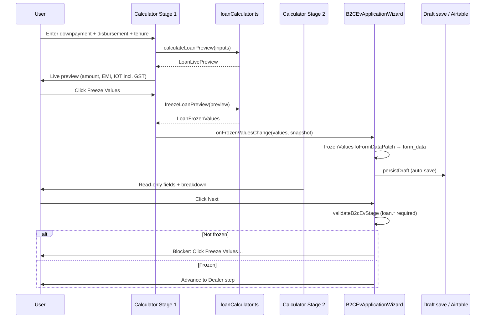

# Loan Details — Calculator Logic

This document describes the business logic, formulas, UI behaviour, and data flow for the **Loan Details** step in the B2C EV application wizard.

**Primary source files**

| File | Role |
|------|------|
| `src/components/applications/LoanCalculator.tsx` | Two-stage UI (calculator + read-only form) |
| `src/lib/loanCalculator.ts` | All loan math, freeze/snapshot helpers |
| `src/config/forms/b2cEvFormSchema.ts` | Wizard stage metadata and `loan.*` field definitions |
| `src/components/applications/B2CEvApplicationWizard.tsx` | Wires calculator into form state, draft save, step validation |
| `src/lib/b2cEvFormValidation.ts` | Step validation, computed-field sync, “Next” blocker messages |

**Local preview (dev only):** `http://localhost:3000/dev/loan-details`

---

## 1. Purpose and UX model

The Loan Details step answers: *“Given what the customer paid upfront and what we disburse to the dealer, what is the financed loan amount, fees, EMI, and disbursal?”*

The page is intentionally split into **two stages**:

### Stage 1 — Loan calculator (editable)

- User enters **Payment from Customer** (downpayment) and **Disbursement to Dealer**.
- **Invoice Value** is computed automatically (read-only).
- User selects **Tenure** (12 or 18 months).
- A **Live preview** updates on every keystroke.
- User clicks **Freeze Values** to lock the calculation.

While frozen, Stage 1 inputs are disabled. **Edit** clears the freeze and allows recalculation.

### Stage 2 — Loan application form (read-only)

- Shows the frozen outputs only: loan amount, tenure, processing fee, GPS/IOT, disbursal.
- User cannot type into these fields; they are filled exclusively from frozen calculator values.
- After freeze, a **Calculation breakdown** panel shows the composition equation and EMI.

### Disclaimer (always visible)

> Insurance and vehicle registration costs are extra and are not included in the loan amount shown in this calculator.

Those costs are captured on later wizard steps (Insurance, Vehicle Details) and use separate GST helpers in `loanCalculator.ts` — they do **not** feed into the loan amount formula on this page.

---

## 2. Fixed constants

Defined in `src/lib/loanCalculator.ts`:

| Constant | Value | Usage on Loan Details page |
|----------|-------|----------------------------|
| `INTEREST_RATE` | **35%** p.a. | Used for live preview EMI and stored on freeze |
| `FEE_PCT` | **8%** (0.08) | Processing fee as share of loan amount |
| `GPS_CHARGES[12]` | **₹2,000** | Base IOT/GPS cost for 12-month tenure |
| `GPS_CHARGES[18]` | **₹2,500** | Base IOT/GPS cost for 18-month tenure |
| `GST_PCT` | **5%** (0.05) | Applied only for **display** of IOT inclusive amount in UI |

**Note:** `INTEREST_RATE_MIN` (30%), `INTEREST_RATE_MAX` (35%), `FEE_PCT_MIN` (6%), and `FEE_PCT_MAX` (8%) are used by the separate **EMI Range Calculator** (`/calculator` → `EmiRangeCalculator`), not by the Loan Details step. The wizard always uses the max values (35% / 8%).

---

## 3. Core formulas

All monetary outputs are rounded to the nearest rupee via `roundRupee()` (`Math.round`).

### 3.1 Invoice value

```
invoiceValue = round(downpayment + disbursementToDealer)
```

Negative inputs are clamped to 0 before addition.

**Example:** downpayment ₹20,000 + disbursement ₹50,000 → invoice value **₹70,000**.

Invoice value is informational on this step (vehicle/insurance invoice context). It does **not** appear in the loan amount formula below.

### 3.2 Loan amount (gross financed amount)

```
gpsBase = GPS_CHARGES[tenureMonths]     // 2000 or 2500
loanAmount = round((disbursementToDealer + gpsBase) / (1 - FEE_PCT))
```

**Intuition:** Processing fee is 8% of the **loan amount** (not of disbursement). GPS/IOT base is included inside the loan. So:

```
loanAmount ≈ disbursement + gpsBase + processingFee
processingFee = loanAmount × 8%
```

Rearranging gives the division-by-`(1 - 0.08)` form.

**Worked example (12 months, from unit tests):**

| Input | Value |
|-------|-------|
| Downpayment | ₹20,000 |
| Disbursement to dealer | ₹50,000 |
| Tenure | 12 months |
| GPS base | ₹2,000 |

```
loanAmount = round((50000 + 2000) / 0.92)
           = round(52000 / 0.92)
           = round(56521.739…)
           = ₹56,522
```

### 3.3 Processing fee

```
processingFee = round(loanAmount × FEE_PCT)
              = round(56522 × 0.08)
              = ₹4,522
```

### 3.4 Disbursal amount (net to dealer, implied)

```
disbursalAmount = round(loanAmount - processingFee - gpsBase)
                = round(56522 - 4522 - 2000)
                = ₹50,000
```

This matches the user-entered disbursement when the formula is consistent.

**Identity (when rounded values align):**

```
loanAmount = disbursalAmount + processingFee + gpsBase
```

### 3.5 EMI (reducing balance)

```
monthlyRate = interestRate / 100 / 12
factor      = (1 + monthlyRate) ^ tenureMonths
emi         = round(loanAmount × monthlyRate × factor / (factor - 1))
```

- Default `interestRate` = **35%** p.a.
- If `loanAmount ≤ 0` or `tenureMonths ≤ 0`, EMI = 0.
- If `monthlyRate === 0`, EMI = `round(loanAmount / tenureMonths)`.

EMI is shown in the live preview and breakdown; it is **not** a required wizard field but is persisted as `loan.emiAmount` when the user freezes.

### 3.6 GPS/IOT display vs loan math (important)

The **loan formulas use the base GPS amount** (₹2,000 / ₹2,500).

The **live preview label “GPS/IOT (including GST)”** shows the GST-inclusive figure:

```
iotInclusive = round(gpsBase + round(gpsBase × 5%))
```

| Tenure | GPS base | GST (5%) | Shown in preview |
|--------|----------|----------|------------------|
| 12 mo | ₹2,000 | ₹100 | **₹2,100** |
| 18 mo | ₹2,500 | ₹125 | **₹2,625** |

Stage 2’s read-only **GPS Charges / IOT** field stores and displays the **base** amount (`loan.gpsCharges`), not the inclusive amount. The breakdown panel shows both base + GST when frozen.

---

## 4. Live preview vs frozen snapshot

### Live preview (`calculateLoanPreview`)

Called on every input change in Stage 1. Returns a `LoanLivePreview`:

| Field | Description |
|-------|-------------|
| `invoiceValue` | Downpayment + disbursement |
| `loanAmount` | Gross loan (formula §3.2) |
| `interestRate` | 35 |
| `tenureMonths` | 12 or 18 |
| `processingFee` | 8% of loan amount |
| `gpsCharges` | Base GPS (2000/2500) |
| `processingFeePctDisplay` | 8 (for display; not shown in simplified preview) |
| `disbursalAmount` | Net after fee and GPS |
| `emiAmount` | EMI at 35% |

The simplified live preview **shows only**: Loan Amount, Tenure, GPS/IOT (incl. GST), EMI. It deliberately hides interest rate, processing fee ₹, processing fee %, and disbursal amount.

### Freeze (`freezeLoanPreview`)

When the user clicks **Freeze Values**:

1. `freezeLoanPreview(preview)` builds a `LoanFrozenValues` object.
2. A `LoanCalculatorSnapshot` is also captured (downpayment, disbursement, invoice value, EMI).
3. Parent (`B2CEvApplicationWizard`) writes these into `form_data` via `frozenValuesToFormDataPatch`.

**Freeze is disabled** when `preview.loanAmount <= 0` (typically zero disbursement).

### Unfreeze (Edit)

Clicking **Edit** calls `onFrozenValuesChange(null)`, which:

- Clears all `loan.*` keys from form data in the wizard.
- Re-enables Stage 1 inputs.

---

## 5. Form data keys written on freeze

`frozenValuesToFormDataPatch(frozen, snapshot)` produces:

| Form key | Source | Example |
|----------|--------|---------|
| `loan.amount` | `frozen.loanAmount` | `"56522"` |
| `loan.interestRate` | `frozen.interestRate` | `"35"` |
| `loan.tenureMonths` | `frozen.tenureMonths` | `"12"` |
| `loan.processingFee` | `frozen.processingFee` | `"4522"` |
| `loan.gpsCharges` | `frozen.gpsCharges` | `"2000"` |
| `loan.processingFeePercent` | `frozen.processingFeePct` | `"8"` |
| `loan.disbursalAmount` | `frozen.disbursalAmount` | `"50000"` |
| `loan.calculator.downpayment` | snapshot | `"20000"` |
| `loan.calculator.disbursementToDealer` | snapshot | `"50000"` |
| `loan.calculator.invoiceValue` | snapshot | `"70000"` |
| `loan.emiAmount` | snapshot | EMI string |

The wizard also sets top-level `requested_loan_amount` from `loan.amount` for API/Airtable promotion.

### Restoring freeze state from a draft

`formDataToFrozenValues(formData)` reverses the above. Returns `null` if `loan.amount ≤ 0`. Used when reopening a draft so the calculator shows as frozen.

---

## 6. Wizard integration

```
B2CEvApplicationWizard (stage id: "loan")
    │
    ├─ formDataToFrozenValues(form_data) → frozenValues | null
    │
    └─ <LoanCalculator
           frozenValues={...}
           onFrozenValuesChange={(values, snapshot) => {
             // Clear all loan.* keys, then merge patch if values != null
             // syncB2cEvComputedFields(nextFormData)
             // Update requested_loan_amount
             // scheduleAutoSave()
           }}
       />
```

After any freeze/unfreeze, the wizard triggers a **silent draft auto-save**.

---

## 7. Validation and “Next” button

### Required to leave Loan Details step

Stage fields in `b2cEvFormSchema` mark these as **required** (non–read-only):

- `loan.amount`
- `loan.interestRate`
- `loan.tenureMonths`
- `loan.processingFee`
- `loan.gpsCharges`

They are only populated after **Freeze Values**. If the user clicks **Next** without freezing:

- Validation fails on empty required fields.
- `buildStepAdvanceBlockerMessage` adds: **“Click Freeze Values in the calculator before continuing.”**

Read-only schema fields (`loan.processingFeePercent`, `loan.disbursalAmount`) are skipped by validation.

### `syncB2cEvComputedFields` (safety net)

If `loan.amount > 0`, the sync helper recalculates:

```
loan.processingFeePercent = (processingFee / loanAmount × 100).toFixed(2)
loan.disbursalAmount      = max(loanAmount - processingFee - gpsCharges, 0)
```

This keeps derived fields consistent if form data is edited elsewhere (e.g. KAM modal).

---

## 8. Related helpers (not primary on this page)

These live in the same module and are used by other features:

| Function | Used for |
|----------|----------|
| `calculateEmiRangePreview` | Standalone `/calculator` page — EMI min/max using 30–35% rate and 6–8% fee |
| `computeFinalInvoiceBreakdown` | Insurance + registration + IOT GST stacking for final invoice totals |
| `computeFinalInvoiceAmount` | Single number: invoice + GST-inclusive IOT, insurance, registration |

**Final invoice example (from tests):**

```
invoiceValue = 70,000
insurance    = 5,000 (base) → 5,250 incl. GST
registration = 2,000 (base) → 2,100 incl. GST
iot base     = 2,000         → 2,100 incl. GST
finalInvoice = 79,450
```

This is **separate** from the loan amount on the Loan Details step.

---

## 9. End-to-end flow (sequence)



---

## 10. Numeric reference table

Using **disbursement ₹50,000**, **downpayment ₹20,000**:

| Tenure | GPS base | Loan amount | Processing fee (8%) | Disbursal | IOT preview (incl. GST) |
|--------|----------|-------------|---------------------|-----------|---------------------------|
| 12 mo | ₹2,000 | ₹56,522 | ₹4,522 | ₹50,000 | ₹2,100 |
| 18 mo | ₹2,500 | ₹57,065 | ₹4,565 | ₹50,000 | ₹2,625 |

Using **disbursement ₹50,000**, **downpayment ₹15,000** (invoice ₹65,000), **18 months**:

- Loan amount: **₹57,065**
- EMI: computed at 35% over 18 months (`calculateEmi(57065, 18)`)

---

## 11. UI test IDs (for QA)

| Test ID | Element |
|---------|---------|
| `loan-calculator` | Root container |
| `loan-extra-costs-disclaimer` | Insurance/registration disclaimer |
| `loan-calc-downpayment` | Payment from Customer |
| `loan-calc-disbursement` | Disbursement to Dealer |
| `loan-calc-invoice` | Invoice Value (computed) |
| `loan-calc-tenure` | Tenure select |
| `loan-calc-preview-amount` | Live preview loan amount |
| `loan-calc-preview-gps` | Live preview IOT incl. GST |
| `loan-calc-preview-emi` | Live preview EMI |
| `loan-calc-freeze` | Freeze Values button |
| `loan-calc-edit` | Edit (unfreeze) button |
| `loan-form-amount` | Stage 2 loan amount |
| `loan-form-math-breakdown` | Post-freeze equation panel |

---

## 12. Design decisions (summary)

1. **Single rate/fee on wizard path** — Always 35% and 8%; range logic is isolated to the standalone calculator.
2. **Freeze gate** — Prevents advancing with stale or manual form edits; Stage 2 is display-only.
3. **GPS base in loan, GST in display** — Loan math uses ₹2,000/₹2,500; UI preview adds 5% GST for customer-facing IOT line.
4. **Invoice value is non-financing** — Sum of customer payment + dealer disbursement; does not drive loan amount.
5. **Rounding at each step** — All amounts are integer rupees; small rounding drift vs pure fractional math is expected.

---

*Last updated to match codebase at commit series including `LoanCalculator.tsx` and `loanCalculator.ts` as of the B2C EV wizard implementation.*
